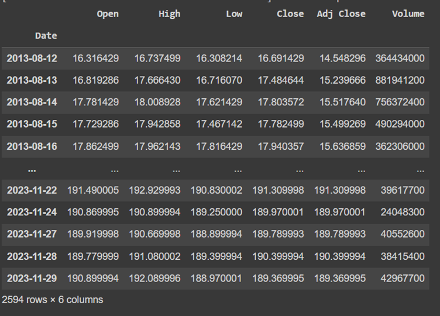
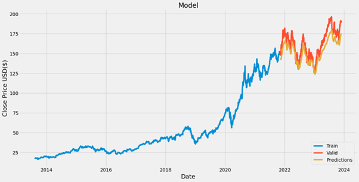

### Insufficient Data Granularity

Lack of details data, just know about stocks' outline information (Open Price, High, Low, Close Price, Volume) while we need more data about market context, companies' details financial report, government policies. 

More over, some numeric data which are significantly important for investors to making decisions for buying/selling stocks, are not provided such as ROI, P/E, liquidity, etc.

### Precision and Recall Evaluation Complexities

Hard to calculate the precision and recall of models because the predictions can be correct about the directions of the stock prices, but have a significant deviation in the price of stocks, compared to the real data.

### Model Performance Discrepancies

Differences in algorithm performance (Linear Regression, Decision Tree, KNN, LSTM) present challenges in predicting stock prices due to difficulties in modeling non-linear relationships and the unpredictable nature of financial data. 

### Historical Price Pattern Learning

The models just calculate base on historical prices of stocks. Therefore, we can understand that the model just learning about "pattern" of the stock prices.

### Conclusion

By addressing these challenges head-on and incorporating innovative solutions, we can enhance the robustness and accuracy of our machine learning models, offering more reliable insights for investors in the unpredictable landscape of the stock market
