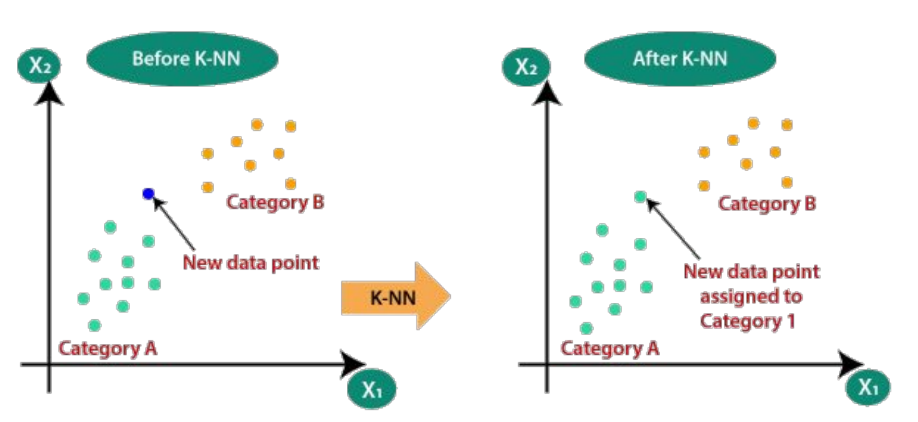
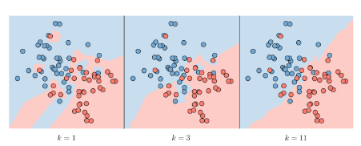

### K-Nearest-Neighbors Algorithm

The K-Nearest Neighbors algorithm, commonly known as KNN, is a non-parametric approach where the response of a data point is determined by the nature of it
k neighbors from the training set. It can be used in both classification and regression settings. KNN uses the entire training set, no training is require.
For the regression the output can be the mean, while for the classification the output can be the most common class

### Calculate the distance between points
Several method can be used to calcukate the distance between points in the dataset, for example:

