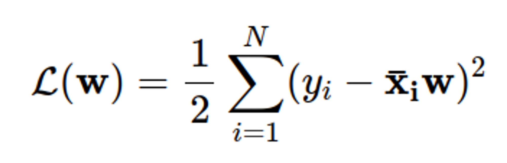
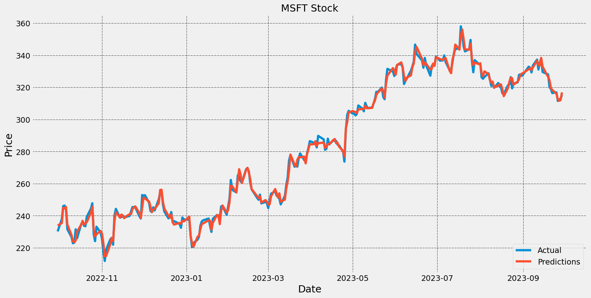
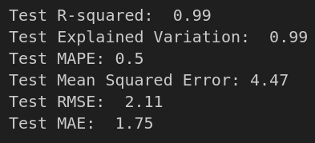

Linear Regression is a statistical method used for modeling the relationship between a dependent variable (target) and one or more independent variables (features). 
It assumes a linear relationship between the variables, meaning that changes in the independent variables are associated with a constant change in the dependent variable. 

 ( Add image here )

-> next slide
The basic form :

Y is the dependent variable (target),X is the independent variable (feature),w0 is the intercept (constant term),w1 is the coefficient for the independent variable, the vector (w0,w1) is called w. 

-> next slide

The goal of linear regression is to find the values of w0 and w1 that minimize the sum of squared differences between the observed and predicted values. This is often done using the method of least squares, particularly we’re trying to minimize the loss function: 

-> next slide
After using the method of least squares, we get the solution:

We use the term A† to define the pseudo-inverse of A, to fix the case that A doesnt have its inverse.
( Bold this line ) THAT IS THE MAIN INTUITIVE IDEA OF LINEAR REGRESSION

-> NEXT SLIDE 
WHY WE USE IT ?
Linear regression is a statistical method that can be used to model the relationship between a dependent variable and one or more independent variables. It can be used for both prediction and explanation purposes, as it can estimate the expected value of the dependent variable based on the values of the independent variables, and also test hypotheses about how the independent variables affect the dependent variable. So, we can use it to predict stock price based on the historical data. 

Stock prices are influenced by many factors, such as market conditions, company performance, news events, investor sentiment, etc. By using linear regression, we can try to find a mathematical equation that best fits the data and captures the trend or pattern of stock prices over time. 

When predicting stock prices, our team will use fundamental features for linear regression, namely the basic attributes of the stock for the day: high, low, close, and volume, to forecast stock prices.

-> NEXT SLIDE :

IMPORT LINEAR REGRESSION AND FIT X_TRAIN AND Y_TRAIN INTO IT:

Then we use this model to predict X_TEST, ASSIGN IT TO Y_TEST_PRED

After implementing the Linear regression on Microsoft stock historical data, plotting Y_TEST AND Y_TEST_PRED, WE HAVE THE GRAPH:

With these evaluation standard:

We find that Linear regression working pretty well when predicting stock price.
